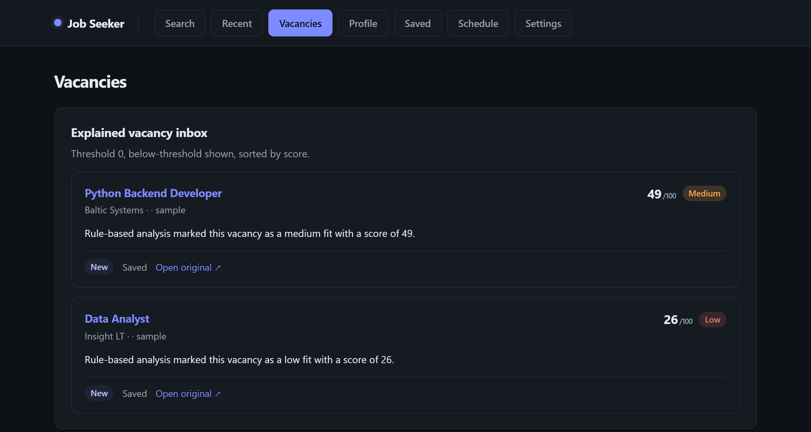

# Robertas Burbo

**AI & Automation Engineer** · Full-Stack · Integrations

Building AI-powered products, automation systems and full-stack applications.

`TypeScript` · `Node.js` · `Python` · `React` · `Next.js` · `PostgreSQL`

## Selected work

<table>
<tr>
<td width="50%" valign="top">

### WEFT

Bilingual EN/LT fashion discovery MVP with explainable concept-graph search, PostgreSQL/Supabase analytics, automated search evaluation and a client-side Three.js fitting-room prototype.

`Next.js` · `React` · `TypeScript` · `PostgreSQL`

[Repository](https://github.com/Yashelly/Fashion_Aggregator) · [Live Demo](https://fashion-aggregator-flame.vercel.app)

</td>
<td width="50%" valign="top">

### Job Seeker Intelligence

Local-first job-search and automation engine: multi-source ingestion, an AI provider abstraction with deterministic fallback, SQLite persistence, and a scheduler with background jobs across web, TUI and CLI.

`Python` · `FastAPI` · `SQLite` · `CI`

[Repository](https://github.com/Yashelly/job-application-agent)

</td>
</tr>
</table>

### Earlier engineering background

Microsoft Entra ID · Intune · Active Directory · Microsoft 365 · PowerShell · Windows Server

Hands-on infrastructure labs and automation projects.

[intune-modern-workplace](https://github.com/Yashelly/intune-modern-workplace) · [intune-endpoint-automation-powershell](https://github.com/Yashelly/intune-endpoint-automation-powershell) · [windows-server-ad-dns-dhcp-gpo](https://github.com/Yashelly/windows-server-ad-dns-dhcp-gpo)

### Education

VILNIUS TECH — BSc, Artificial Intelligence Systems · Microsoft AZ-900 · Google — System Administration and IT Infrastructure Services
